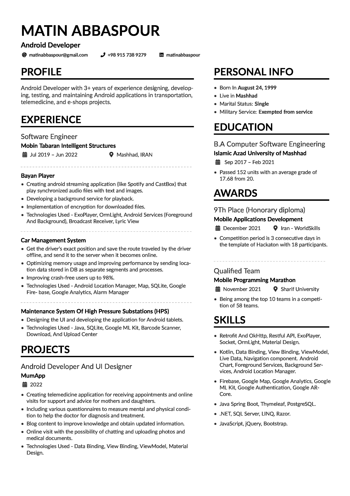

# Matin Abbaspour Resume

v1.0.0 (16 Nov. 2022)

This is a fully customizable resume template in LaTeX that can be used for software engineers, developers, and designers. Separate sections are included to show experience, awards, publications, and more.

To see the main library and examples, you can go to this [link](https://github.com/liantze/AltaCV).

To use the Font Awesome 5 icon, you can see the documentation [here](http://mirrors.ibiblio.org/CTAN/fonts/fontawesome5/doc/fontawesome5.pdf).

## Samples

This is what the resume looks like:

